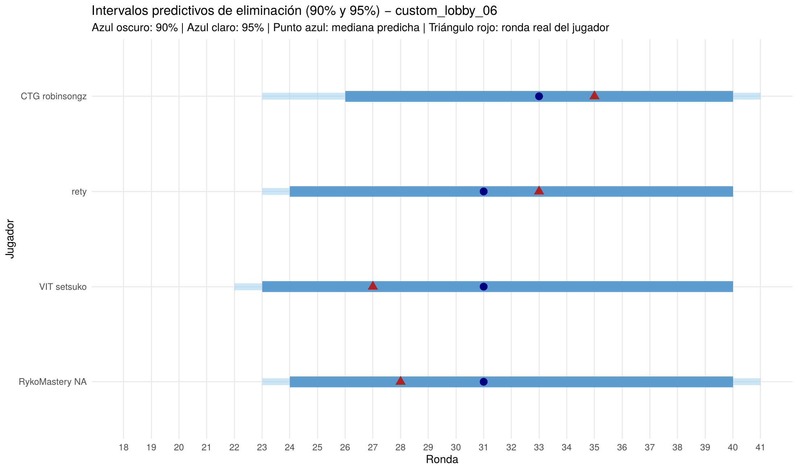

# Probabilistic Placement Prediction in Teamfight Tactics (TFT)
### A Bayesian Nonparametric Survival Analysis with BART

> Predicting per-round elimination probabilities for competitive TFT players using **only pre-match information** — player history and lobby-relative context — via Bayesian Additive Regression Trees (BART) framed as discrete-time survival analysis.

<!-- HERO FIGURE: export your posterior survival curves plot here. This is the first thing a Riot data scientist will see. -->



---

## Overview

Teamfight Tactics matches are a natural survival problem: eight players fight until their HP reaches zero, and the round at which each player is eliminated defines a discrete event time. This project models that process with **BART + probit latent variables (Albert–Chib data augmentation)**, estimating each player's dynamic elimination probability at every round of the match.

The central design constraint: **zero in-match information is used as a predictor.** All features are built strictly from data available *before* the target match begins.

## Key Findings

- **BART outperformed Kaplan–Meier** estimators (RMSE / MAE) on simulated benchmarks with non-proportional hazards and crossing survival curves, where classical parametric approaches degrade.
- On real tournament data, **100% of observed eliminations fell within the model's 90/95% credible intervals**; in 16 of 24 tournament scenarios the central estimate landed within ~3 rounds of the true elimination round.
- Estimated survival curves reproduce the **staged macro-dynamics of TFT** (plateaus on PvE/carousel rounds) and the empirical elimination order of lobbies.
- **Honest limitation:** credible intervals are wide (often spanning 2+ game stages). Pre-match signal robustly predicts a lobby's *relative merit ordering*, but the in-game variance of TFT (shop RNG, matchups, tactical decisions) makes exact elimination timing irreducibly uncertain.

## Methodology

| Component | Choice |
|---|---|
| Time scale | Final round reached (discrete) |
| Event | Elimination (placements 2–8); winner right-censored |
| Model | BART, m = 200 weak-learner trees, probit link |
| Inference | MCMC with Albert–Chib latent-variable augmentation |
| Regularization | Depth prior α = 0.95, γ = 2; leaf shrinkage N(0, 2.25/m) |
| Features | 50+ leakage-free covariates: empirical-Bayes smoothed player histories + lobby-relative strength metrics |
| Evaluation | Integrated Brier Score, log-loss, Spearman ρ, Kendall τ, C-index |

### Pipeline

1. **Account resolution & match extraction** — Riot Games API (Riot ID → PUUID), ranked matches, patches 16.4–16.6, maturity filters (level ≥ 4, round > 18).
2. **Per-player history construction** — metrics computed strictly from data chronologically prior to each target match.
3. **Burn-in & smoothing** — first 10 matches per player used only to stabilize histories (empirical-Bayes shrinkage toward the global mean), never as training targets.
4. **Lobby reconstruction** — relative-strength features against available opponents (placement/survival advantage, historical lobby rankings, stronger-opponent counts).
5. **Longitudinal expansion** — cross-sectional records expanded into a binary sequential survival matrix indexed by round.
6. **BART training** — four specifications benchmarked (full vs. PCA-reduced covariates; partial vs. enriched lobbies).
7. **Prediction & evaluation** — fixed prediction horizon to prevent future-data contamination.

## Repository Structure

```
├── paper/            # Full paper (PDF)
├── R/                # Pipeline scripts (extraction, features, expansion, model)
├── figures/          # Survival curves, credible intervals, benchmark plots
└── README.md
```

## Reproducibility & Data

Match data was collected through the **official Riot Games API** under its developer policies. Raw match data is **not redistributed** in this repository, in compliance with Riot's Terms of Service — the extraction scripts allow reproduction with your own API key from the [Riot Developer Portal](https://developer.riotgames.com/).

## Author

**Alain Phillip Jay** — Mathematical Engineering, Universidad EAFIT (Medellín, Colombia)
📧 alainp.jay@gmail.com · [LinkedIn](https://www.linkedin.com/in/alain-jay-421635306/)

## Disclaimer

This project was created under Riot Games' [Legal Jibber Jabber](https://www.riotgames.com/en/legal) policy using assets owned by Riot Games. Riot Games does not endorse or sponsor this project. *Teamfight Tactics* and *Riot Games* are trademarks or registered trademarks of Riot Games, Inc.
